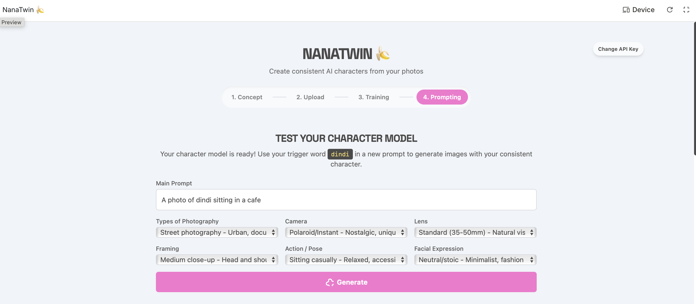

<div align="center">

</div>

# NanaTwin 🍌

**Create consistent AI characters from your photos**

NanaTwin is a web application that leverages Google's Imagen 4 (nano-banana) to generate consistent character images across different scenarios. Built with Google AI Studio and Gemini, it provides an intuitive interface for creating professional-looking character shots with precise control over photography parameters.

<div align="center">
  
[](https://ai.google.dev/aistudio)
[](https://deepmind.google/technologies/gemini/)
[](https://deepmind.google/technologies/imagen-3/)

</div>

---

## ✨ Features

- **Character Consistency**: Upload up to 15 photos and generate consistent character images across different scenarios
- **Custom Trigger Word**: Each trained model gets a unique trigger word (e.g., `dindi`) to use in prompts
- **Photography Controls**: Fine-tune your generations with professional parameters:
  - 📸 **Camera Types**: Polaroid/Instant, DSLR, Mirrorless, Film, and more
  - 🎭 **Photography Styles**: Street, Portrait, Documentary, Fashion, etc.
  - 🎬 **Framing Options**: Close-up, Medium shot, Wide angle, etc.
  - 😊 **Facial Expressions**: Neutral, Smiling, Serious, Surprised, and more
  - 🎯 **Action/Pose**: Sitting casually, Standing confidently, Walking, etc.
- **4-Step Workflow**: Concept → Upload → Training → Prompting
- **Real-time Generation**: See your results in a gallery view

---

## 🖼️ Screenshots

### Prompting Interface


*Control every aspect of your character generation with intuitive dropdowns*

### Generated Results


*Consistent character across multiple scenarios and settings*

---

## 🚀 Getting Started

### Prerequisites

- Node.js (v16 or higher)
- A Google Gemini API key ([Get one here](https://aistudio.google.com/app/apikey))

### Installation

1. **Clone the repository**
   ```bash
   git clone https://github.com/dindicoelho/nanatwin.git
   cd nanatwin
   ```

2. **Install dependencies**
   ```bash
   npm install
   ```

3. **Set up your API key**
   
   Create a `.env.local` file in the root directory and add your Gemini API key:
   ```env
   GEMINI_API_KEY=your_api_key_here
   ```

4. **Run the development server**
   ```bash
   npm run dev
   ```

5. **Open your browser**
   
   Navigate to `http://localhost:3000`

---

## 📖 How to Use

1. **Concept Phase**: Define what kind of character you want to create
2. **Upload Phase**: Upload 5-15 photos of your subject (more photos = better consistency)
3. **Training Phase**: Wait for the model to train on your photos (this may take a few minutes)
4. **Prompting Phase**: 
   - Use your trigger word in prompts (e.g., "A photo of `dindi` sitting in a cafe")
   - Select photography parameters from the dropdowns
   - Click "Generate" to create your images

### Example Prompt
```
A photo of dindi sitting in a cafe

Types of Photography: Street photography - Urban, documentary style
Camera: Polaroid/Instant - Nostalgic, unique color rendition
Lens: Standard (35-50mm) - Natural vision, versatile use
Framing: Medium close-up - Head and shoulders visible
Action/Pose: Sitting casually - Relaxed, accessible demeanor
Facial Expression: Neutral/stoic - Minimalist, fashion-forward vibe
```

---

## 🛠️ Built With

- **[Google AI Studio](https://ai.google.dev/aistudio)** - Development environment
- **[Gemini](https://deepmind.google/technologies/gemini/)** - AI assistance for coding
- **[Imagen 4 (nano-banana)](https://deepmind.google/technologies/imagen-3/)** - Character consistency model
- **React/Next.js** - Frontend framework
- **Tailwind CSS** - Styling

---

## 🎯 Why NanaTwin?

I built NanaTwin as an experiment to test Google's Imagen 4 capabilities. While I knew nano-banana was technically superior for character consistency, I was hesitant to use Gemini for coding. This project changed my perspective - the integration between Gemini and Google AI Studio made the development process surprisingly smooth and enjoyable.

---

## 🤝 Contributing

Feedback and contributions are welcome! Feel free to:
- Open an issue for bugs or feature requests
- Submit a pull request
- Share your experience using NanaTwin

---

## 📝 License

This project is open source and available under the [MIT License](LICENSE).

---

## 🔗 Links

- **AI Studio Project**: [View in AI Studio](https://ai.studio/apps/drive/1P-z9XoB34f6TedInpzABEhAiCXIsuFo7)
- **Author**: [@dindicoelho](https://github.com/dindicoelho)

---

<div align="center">
Made with 🍌 and ✨ by Dindi Coelho
</div>
